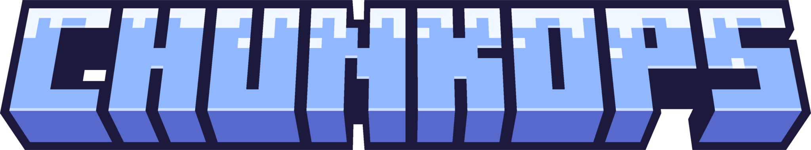

<p align="center">
  
</p>


Website for ChunkOps. Built using [Hugo](https://gohugo.io/).

## Local development

### Requirements
- [Hugo (extended edition)](https://gohugo.io/getting-started/installing/)
- [Go](https://golang.org/doc/install)
- [git](https://git-scm.com)

A Visual Studio Code Dev Container configured with these dependencies is available in `.devcontainer/devcontainer.json`


### Setup

```shell
# Clone the repo
git clone https://github.com/solarith0/chunkops.com.git

# Change directory
cd chunkops.com

# Start the server
hugo mod tidy
hugo server --logLevel debug --disableFastRender -p 1313
```

> [!NOTE]
> If using a container, you may want to use the `--poll` switch to enable polling instead of relying on file system events
> ```shell
> hugo server --buildDrafts --disableFastRender --poll 500ms
> ```

### Update theme

```shell
hugo mod get -u
hugo mod tidy
```

See [Update modules](https://gohugo.io/hugo-modules/use-modules/#update-modules) for more details.

## Acknowledgments

This project uses the [Hextra](https://github.com/imfing/hextra) theme, licensed under the [MIT license](https://opensource.org/licenses/MIT), and was created using the [Hextra Starter Template](https://github.com/imfing/hextra-starter-template).

Built with Hugo, an open-source static site generator licensed under the [Apache 2.0 license](https://opensource.org/license/apache-2-0).

Favicon was generated using graphics from [Twitter Twemoji](https://github.com/twitter/twemoji):
- Graphics Title: 1f4e6.svg
- Author: Copyright 2020 Twitter, Inc and other contributors ([GitHub repository](https://github.com/twitter/twemoji))
- Source: [1f4e6.svg](https://github.com/twitter/twemoji/blob/master/assets/svg/1f4e6.svg)
- License: [CC-BY 4.0](https://creativecommons.org/licenses/by/4.0/)
